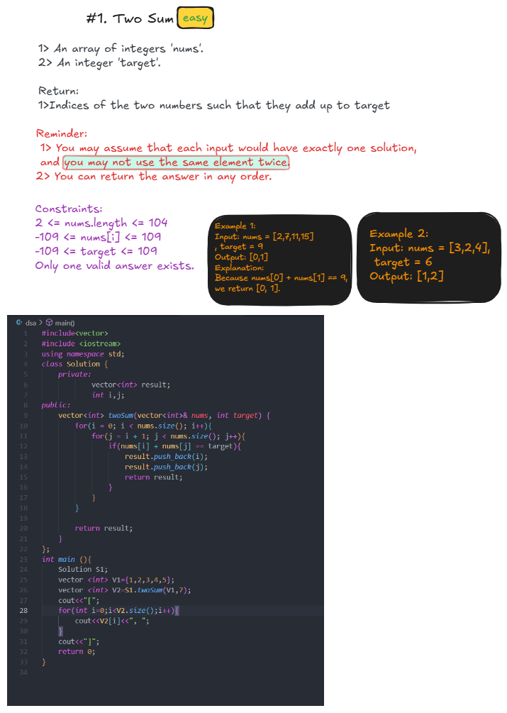

  
# #1 Two Sum
### [LeetCode Problem #1](https://leetcode.com/problems/two-sum/)

---

## 📝 Problem Statement
Given an array of integers `nums` and an integer `target`, return **indices of the two numbers** such that they add up to `target`.

You may assume that each input would have **exactly one solution**, and you may not use the same element twice.

You can return the answer in any order.

---

## ✨ Examples
<table align="center">
<tr>
<th>🔸 Input</th>
<th>🔸 Output</th>
<th>🔸 Explanation</th>
</tr>
<tr>
<td><code>nums = [2,7,11,15], target = 9</code></td>
<td><code>[0,1]</code></td>
<td>Because <code>nums[0] + nums[1] == 9</code></td>
</tr>
<tr>
<td><code>nums = [3,2,4], target = 6</code></td>
<td><code>[1,2]</code></td>
<td>Because <code>nums[1] + nums[2] == 6</code></td>
</tr>
<tr>
<td><code>nums = [3,3], target = 6</code></td>
<td><code>[0,1]</code></td>
<td>Because <code>nums[0] + nums[1] == 6</code></td>
</tr>
</table>

---

## 🚀 Algorithm Approach
### Key Insight
> Use a hash map to store previously seen numbers and their indices for O(1) lookup

### **Approach 1: Brute Force**
1. **Check all pairs** using nested loops
2. **Return indices** when sum equals target
3. **Time:** O(n²), **Space:** O(1)

### **Approach 2: Hash Map (Optimal)**
1. **Initialize** empty hash map
2. **For each element:**
   - Calculate complement = target - current element
   - If complement exists in map → return [map[complement], current_index]
   - Store current element and index in map
3. **Return** the pair of indices

---
---

## 🎨 Visualization

  
### Algorithm Flow Demonstration

---
## 📊 Complexity Analysis
| Approach | Time Complexity | Space Complexity |
|----------|----------------|------------------|
| **Brute Force** | `O(n²)` | `O(1)` |
| **Hash Map** | `O(n)` | `O(n)` |

---

## 🔧 Constraints
- `2 <= nums.length <= 10⁴`
- `-10⁹ <= nums[i] <= 10⁹`
- `-10⁹ <= target <= 10⁹`
- **Only one valid answer exists**

---

## 💡 Follow-up
**Can you come up with an algorithm that is less than O(n²) time complexity?**

*Answer: Yes! The hash map approach achieves O(n) time complexity.*

---

